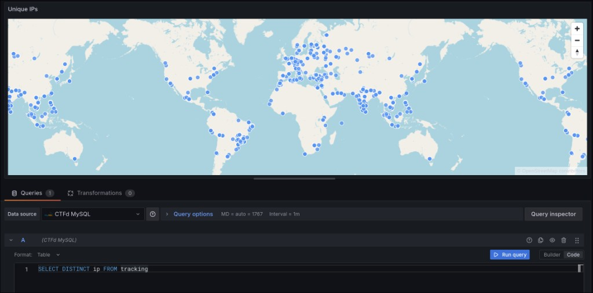

# Grafana GeoIP Map

[English version](README.md)



Панель для Grafana, которая получает IP-адреса из существующего datasource, определяет координаты через локальную базу MaxMind и отображает точки на карте. Менять MySQL datasource и сохранять координаты в базе не нужно.

Проект состоит из:

- `local-geoipmap-panel` — панель Grafana на React и MapLibre;
- `geoip-service` — локальный HTTP API на Go, читающий `GeoLite2-City.mmdb`;
- `deploy` — файлы для добавления решения в существующий Docker Compose deployment.

Поддерживаемая версия: Grafana 12.2.0 и новее.

## Установка в существующий Docker Compose deployment

Ниже предполагается, что:

- существующая Grafana уже запускается через `docker compose`;
- репозиторий клонируется рядом с существующим `docker-compose.yml`;
- публичный адрес Grafana — `https://grafana.example.com`;
- перед Grafana работает nginx или другой reverse proxy.

Пример структуры локальных каталогов:

```text
grafana-deployment/
├── docker-compose.yml
└── grafana-geoip-map/
```

### 1. Клонировать репозиторий

```bash
cd ./grafana-deployment
git clone https://github.com/Kochanac/grafana-geoip-map.git
cd ./grafana-geoip-map
```

Node.js на сервер устанавливать не требуется: frontend собирается внутри Docker.

### 2. Скачать базу MaxMind

1. Зарегистрироваться в [MaxMind](https://www.maxmind.com/en/geolite2/signup).
2. Открыть **Download Databases**.
3. Скачать **GeoLite2 City** в формате `MMDB`.
4. Распаковать архив и положить файл сюда:

```text
./GeoLite2-City.mmdb
```

Проверить:

```bash
test -f ./GeoLite2-City.mmdb && echo "MMDB found"
```

База не включена в репозиторий из-за условий лицензии MaxMind.

### 3. Указать исходный образ Grafana

Плагин устанавливается в производный Docker image поверх вашего существующего образа. Данные и настройки Grafana при этом не изменяются.

В `Dockerfile FROM` нельзя передавать локальный image ID вида `sha256:...`: BuildKit воспримет его как имя репозитория и попробует скачать из Docker Hub. Сначала присвоить существующему образу локальный тег:

```bash
docker tag \
  sha256:845d83e1cf13d8b78b3061c95de03424b5d275ab45ecfdcff9dfd4cbfcddf1a8 \
  grafana-base-local:12.2.0

docker image inspect grafana-base-local:12.2.0 --format '{{.Id}}'
```

Находясь в каталоге `grafana-geoip-map`, создать локальный `.env`. Переменная `$PWD` автоматически запишет абсолютный путь текущего checkout:

```bash
cat > .env <<EOF
GEOIP_MAP_ROOT=$PWD
GRAFANA_BASE_IMAGE=grafana-base-local:12.2.0
GRAFANA_PUBLIC_ORIGIN=https://grafana.example.com
GRAFANA_UNSIGNED_PLUGINS=local-geoipmap-panel
GEOIP_MAX_BATCH_SIZE=1000
EOF
```

Вместо локального тега можно указать исходный registry-тег, например `grafana/grafana:12.2.0`.

Если в Grafana уже разрешены другие unsigned plugins, перечислить все ID через запятую:

```dotenv
GRAFANA_UNSIGNED_PLUGINS=existing-plugin-panel,local-geoipmap-panel
```

### 4. Подключить override к существующему Compose

Основной Compose-файл в примере находится на уровень выше: `../docker-compose.yml`. Сервис Grafana в нём должен называться `grafana`.

#### Вариант A: отдельный override-файл

Проверить итоговую конфигурацию:

```bash
docker compose \
  --env-file .env \
  -f ../docker-compose.yml \
  -f ./deploy/docker-compose.geoip.yml \
  config
```

Важно: override рассчитан на сервис с именем `grafana`. Если ваш сервис называется иначе, измените имя в `deploy/docker-compose.geoip.yml`.

Собрать image с панелью и запустить deployment:

```bash
docker compose \
  --env-file .env \
  -f ../docker-compose.yml \
  -f ./deploy/docker-compose.geoip.yml \
  up -d --build
```

#### Вариант B: дописать сервисы в основной docker-compose.yml

Вместо подключения override можно открыть существующий `../docker-compose.yml` и дополнить сервис `grafana`, сохранив все его текущие настройки:

```yaml
services:
  grafana:
    # Остальные существующие настройки Grafana оставить без изменений.
    image: grafana-with-geoip-map:12.2.0
    build:
      context: ./grafana-geoip-map
      dockerfile: deploy/Dockerfile.grafana
      args:
        # Локальный image ID необходимо предварительно тегировать.
        GRAFANA_IMAGE: grafana-base-local:12.2.0
    environment:
      # Сохранить остальные существующие environment-переменные.
      GF_PLUGINS_ALLOW_LOADING_UNSIGNED_PLUGINS: local-geoipmap-panel
    depends_on:
      - geoip-map-api

  geoip-map-api:
    build:
      context: ./grafana-geoip-map/geoip-service
    restart: unless-stopped
    environment:
      GEOIP_DB_PATH: /data/GeoLite2-City.mmdb
      ALLOWED_ORIGINS: https://grafana.example.com
      MAX_BATCH_SIZE: 1000
    volumes:
      - ./grafana-geoip-map/GeoLite2-City.mmdb:/data/GeoLite2-City.mmdb:ro
    ports:
      - "127.0.0.1:18080:8080"
```

Если `GF_PLUGINS_ALLOW_LOADING_UNSIGNED_PLUGINS` уже задан, добавить `local-geoipmap-panel` в существующий список через запятую, а не заменять его.

Проверить и применить изменённый Compose:

```bash
cd ..
docker compose config
docker compose up -d --build
```

При сборке:

1. Docker собирает frontend-плагин;
2. копирует `dist` в `/usr/share/grafana/external-plugins/local-geoipmap-panel`;
3. запускает локальный GeoIP API;
4. перезапускает Grafana с разрешённым unsigned plugin.

Отдельный каталог нужен потому, что распространённый bind mount
`./grafana/data:/var/lib/grafana` скрывает содержимое `/var/lib/grafana`
из Docker image.

### 5. Подключить GeoIP API к reverse proxy

Код панели выполняется в браузере пользователя. Адрес вида `http://geoip-map-api:8080` работать не будет: Docker DNS доступен контейнерам, но не браузеру.

GeoIP API публикуется только на `127.0.0.1:18080`. Для nginx, работающего на Docker-хосте, добавить:

```nginx
location /geoip/ {
    proxy_pass http://127.0.0.1:18080/;
    proxy_set_header Host $host;
    proxy_set_header X-Forwarded-Proto $scheme;
    proxy_set_header X-Forwarded-For $proxy_add_x_forwarded_for;
}
```

Проверить конфигурацию и перезагрузить nginx:

```bash
sudo nginx -t
sudo systemctl reload nginx
```

Проверить API:

```bash
curl https://grafana.example.com/geoip/health
```

Ожидаемый ответ:

```json
{"status":"ok"}
```

Если reverse proxy сам работает в Docker Compose, можно не публиковать порт `18080`, а направить `proxy_pass` на `http://geoip-map-api:8080/` внутри общей Docker network.

### 6. Настроить панель в Grafana

1. Открыть dashboard.
2. Нажать **Add visualization**.
3. Выбрать существующий MySQL datasource.
4. Выбрать визуализацию **GeoIP Map**.
5. В **GeoIP service URL** указать:

```text
https://grafana.example.com/geoip
```

6. В **IP field** указать имя колонки с IP.

Пример MySQL-запроса:

```sql
SELECT
  public_ip AS ip,
  COUNT(*) AS requests
FROM events
WHERE $__timeFilter(created_at)
GROUP BY public_ip;
```

Настройки панели:

- **IP field**: `ip`;
- **Value field**: `requests`;
- **GeoIP service URL**: `https://grafana.example.com/geoip`;
- **Lookup batch size**: не больше `GEOIP_MAX_BATCH_SIZE`; панель загрузит все
  уникальные IP последовательными запросами указанного размера.

Панель поддерживает публичные IPv4 и IPv6. Приватные, loopback и некорректные адреса игнорируются.

## Проверка и диагностика

Состояние контейнеров:

```bash
docker compose \
  --env-file .env \
  -f ../docker-compose.yml \
  -f ./deploy/docker-compose.geoip.yml \
  ps
```

Логи:

```bash
docker compose \
  --env-file .env \
  -f ../docker-compose.yml \
  -f ./deploy/docker-compose.geoip.yml \
  logs grafana geoip-map-api
```

Проверка lookup:

```bash
curl -X POST https://grafana.example.com/geoip/v1/lookup \
  -H 'Content-Type: application/json' \
  -d '{"ips":["8.8.8.8","1.1.1.1"]}'
```

Если панель отсутствует в списке:

1. убедиться, что контейнер Grafana был пересоздан;
2. проверить `GF_PLUGINS_ALLOW_LOADING_UNSIGNED_PLUGINS`;
3. проверить наличие `/usr/share/grafana/external-plugins/local-geoipmap-panel/plugin.json` внутри контейнера;
4. посмотреть логи Grafana.

Если браузер показывает `Failed to fetch`:

1. проверить `curl https://grafana.example.com/geoip/health`;
2. убедиться, что URL панели использует HTTPS вместе с HTTPS Grafana;
3. проверить `GRAFANA_PUBLIC_ORIGIN`;
4. открыть DevTools браузера и проверить CORS/Network ошибки.

## Обновление

```bash
cd ./grafana-geoip-map
git pull

docker compose \
  --env-file .env \
  -f ../docker-compose.yml \
  -f ./deploy/docker-compose.geoip.yml \
  up -d --build
```

Файл `GeoLite2-City.mmdb` необходимо регулярно обновлять отдельно. После замены файла перезапустить API:

```bash
docker compose \
  --env-file .env \
  -f ../docker-compose.yml \
  -f ./deploy/docker-compose.geoip.yml \
  restart geoip-map-api
```

GeoLite2 возвращает приблизительное местоположение и не предназначен для определения конкретного адреса или домохозяйства.
